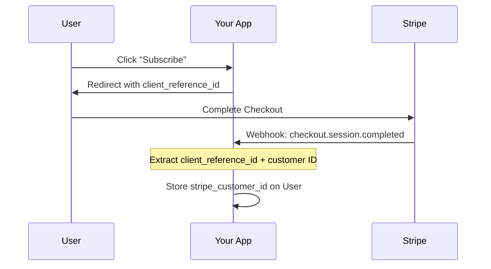

# Example: What a Great findings.md Looks Like

This is an annotated example showing the claim ledger, point-of-claim citations, confidence flags, inline conflict citations, an earning diagram, and the mandatory Gaps and Open Questions sections. Comments in `<!-- -->` explain the patterns.

---

# Research Findings: Stripe Minimal Backend Integration

**Date:** 2025-12-16

[← Back to Index](./index.md)

<!-- No executive summary restating the verdict — the verdict lives in the index answer block and recommendations.md only (verdict ≤2 places). findings.md is where the evidence lives. -->

## Claim Ledger

| # | Claim | Verdict | Evidence |
|---|-------|---------|----------|
| 1 | Pricing Table checkout requires zero backend code | Confirmed | [Stripe docs](https://docs.stripe.com/payments/checkout/pricing-table) + [community implementation report](https://stackoverflow.com/q/example) (independent — different evidence kinds) |
| 2 | `client_reference_id` reliably links purchases to internal users | Confirmed | [API reference](https://docs.stripe.com/api/checkout/sessions/object#checkout_session_object-client_reference_id) + verified in the checkout session payload of a test event |
| 3 | One webhook (`checkout.session.completed`) is sufficient to start | Confirmed | [webhook docs](https://docs.stripe.com/billing/subscriptions/webhooks) + [sample repo](https://github.com/stripe-samples/checkout-single-subscription) using exactly this surface |
| 4 | Read-rate limits won't matter at our volume | Single-source | [rate limit docs](https://docs.stripe.com/rate-limits) give global limits only; no numbers specific to subscription list queries found |

<!-- Deep path only. One row per load-bearing claim — the 3-6 claims where, if false, the index verdict flips. The Verdict column uses the exact vocabulary (Confirmed / Single-source / Contested / Estimated / Unverified) — the HTML view styles it automatically. Evidence cells say WHY sources are independent, and claim 4 shows honesty: it stays Single-source rather than being dressed up. -->

## Stripe's No-Code Checkout Options

<!-- Findings are organized by topic, not numbered rigidly. The heading describes the topic area, not "Finding 1." -->

Payment Links and the embeddable Pricing Table handle checkout without any backend code ([Pricing Table docs](https://docs.stripe.com/payments/checkout/pricing-table)). Products, prices, and checkout UI are all configured in the Stripe Dashboard.

**Pricing Table** is the best fit for subscription-based products:
- Embeddable web component (`<stripe-pricing-table>`) showing subscription tiers
- Checkout happens on Stripe's hosted page — no card data touches your server
- Pass `client_reference_id` to link purchases to your users

**Payment Links** work best for one-off products or simple checkout:
- Shareable URLs that direct to Stripe-hosted checkout
- Append `client_reference_id={your_user_id}` to the URL

<!-- Point-of-claim citation: the load-bearing fact ("without any backend code") carries its link WHERE it is asserted. resources.md is the bibliography, never the only claim→source map. -->

```
https://buy.stripe.com/abc123?client_reference_id=user_456&prefilled_email=user@example.com
```

## Linking Purchases to Your Users

The `client_reference_id` URL parameter (max 200 chars — [API reference](https://docs.stripe.com/api/checkout/sessions/object#checkout_session_object-client_reference_id)) is the mechanism for connecting Stripe purchases to your internal user accounts.



<!-- This diagram EARNS its place under the rubric: an interaction sequence between three systems over time — structure prose serializes poorly. Note there is no mindmap of the report's sections anywhere, and no speculative Gantt. -->

> **Note:** `client_reference_id` only appears in successful checkout events, not in failed payment events. For failed payments, look up by email or use the customer ID if already stored. This is documented in Stripe's API reference but easy to miss.

<!-- A gotcha flag — called out because it's easy to miss, not because the source is unreliable. -->

## Webhook Requirements

For a minimal integration, you need only 1-2 webhook events:

| Event | When It Fires | What You Do | Confidence |
|-------|---------------|-------------|------------|
| `checkout.session.completed` | Purchase completes | Store Stripe customer ID on your user | High |
| `customer.subscription.deleted` | Subscription ends | Revoke premium access | High |
| `invoice.payment_failed` | Payment fails | Notify user (optional) | Medium |

<!-- Clean GFM table; the Confidence column gets pill styling in the HTML view automatically. Values stay plain text in markdown. -->

You can start with just `checkout.session.completed` and add others as needed.

**Alternative — polling instead of webhooks:**

> **Conflicting guidance:** [Stripe's webhook documentation](https://docs.stripe.com/billing/subscriptions/webhooks) recommends webhooks as the primary mechanism for staying in sync. However, [Stripe's subscription API docs](https://docs.stripe.com/api/subscriptions/list) also support direct API queries, and several [community discussions (2025)](https://stackoverflow.com) describe polling-at-login as sufficient for low-traffic applications. **Tiebreaker:** official recommendation wins for the default, but our simplicity-first constraint makes polling viable at our volume — webhooks can be added when status freshness starts to matter.

<!-- The conflicting-sources pattern: both perspectives documented, sources cited inline, and the tiebreaker NAMED — the reader sees which principle decided it, not just the outcome. -->

## Querying Stripe API for Status

Instead of caching subscription status locally, query Stripe directly:

```elixir
def check_subscription(user) do
  case Stripe.Subscription.list(%{customer: user.stripe_customer_id}) do
    {:ok, %{data: [%{status: "active"} | _]}} -> :active
    {:ok, %{data: [%{status: status} | _]}} -> String.to_atom(status)
    {:ok, %{data: []}} -> :none
    {:error, _} -> :error
  end
end
```

**Trade-offs:**
- (+) Always fresh data, no sync complexity
- (-) Network latency on every status check — roughly 100-300ms per call (estimated, not measured)
- (-) Subject to Stripe rate limits (not an issue at low volume — see ledger claim 4)

<!-- The measured-vs-estimated rule in action: a decision-relevant number the research did not benchmark carries the explicit tag instead of posing as a measurement. -->

> **Low confidence:** if volume grows, a short-TTL cache (5 min) invalidated by webhooks is the standard mitigation — but no Stripe-specific rate limit documentation for subscription list queries was found, so the scaling threshold is unknown.

<!-- A confidence flag with the REASON. Note the language stays hedged — no "clearly" or "trivially" on a claim the report itself couldn't verify (adjective discipline). -->

## Cross-Cutting Themes

1. **Stripe handles the hard parts:** Payment processing, PCI compliance, card storage, SCA/3DS, failed payment retries — all delegated to Stripe's hosted infrastructure.
2. **Your backend is just the glue:** The only custom code maps user IDs to Stripe customer IDs. Everything else uses Stripe's hosted solutions or API.
3. **Simplicity vs flexibility trade-off:** No-code solutions are fastest but least customizable. The more control you need, the more backend code is required.

<!-- Cross-cutting themes synthesize across findings — patterns that span the whole research, not just individual topics. -->

## Gaps & Limitations

- **Pricing Table limited to 4 products per interval** — may not fit all pricing models; if yours needs more, the answer flips to Checkout Sessions API
- **Customer Portal cannot be embedded in an iframe** — users leave your app to manage subscriptions
- **Usage-based billing not supported by Pricing Table** — requires Checkout Sessions API
- **We did not prototype the webhook endpoint** — the "one endpoint suffices" conclusion is from docs + samples (ledger claims 1, 3), not from running one

<!-- Mandatory section. Each gap states what it MEANS for the conclusions, not just what's missing. The last bullet is the most important kind: what the research did NOT do. -->

## Open Questions

- Does the Pricing Table's `client_reference_id` survive the trial-to-paid conversion flow, or only direct checkouts?
- What is the actual rate-limit threshold for subscription list queries at scale?
- **Premise:** this research assumes checkout should live in Stripe's hosted UI — if brand-consistent checkout ever becomes a product requirement, the hosted-first approach is the wrong foundation, not just the wrong configuration.

<!-- Mandatory section, and at least one question must be premise-level — challenging the framing itself, not just tactical details. Tactical open questions are where deep dives come from; the premise question is where "we researched the wrong thing" gets caught early. -->

## Related Documents

- [Index](./index.md) — Research overview
- [Resources](./resources.md) — All sources consulted
- [Recommendations](./recommendations.md) — Implementation plan
