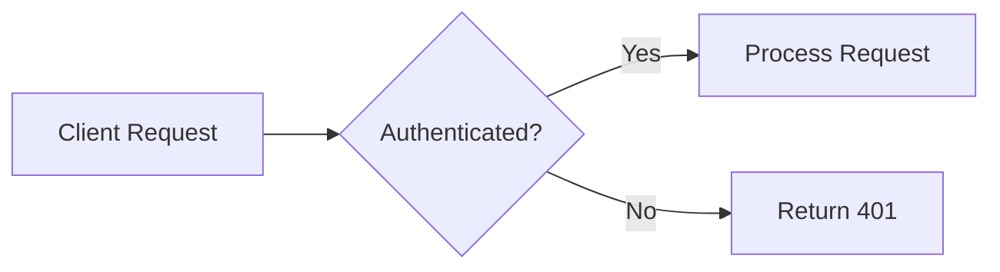
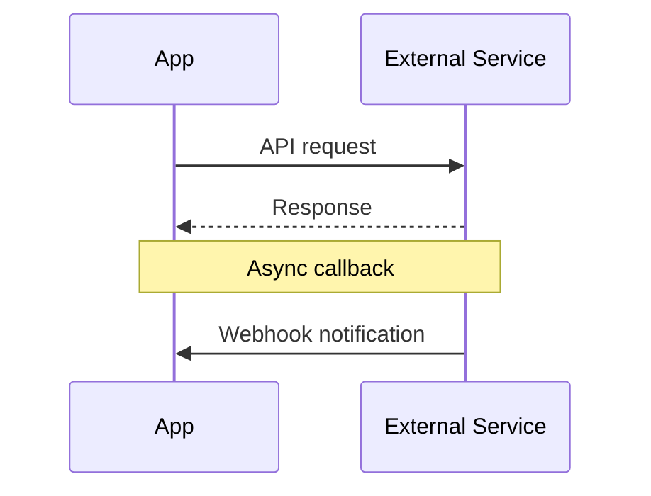
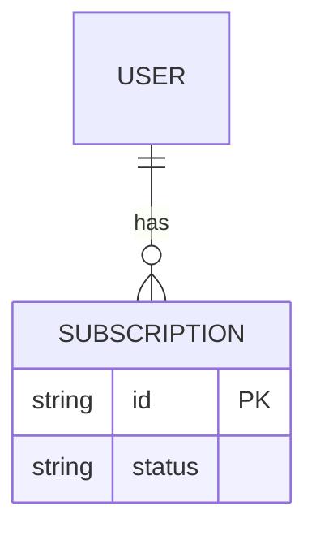
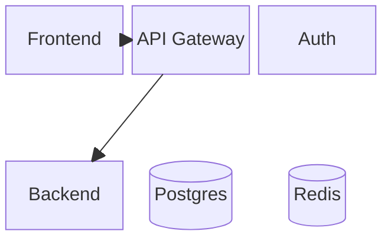
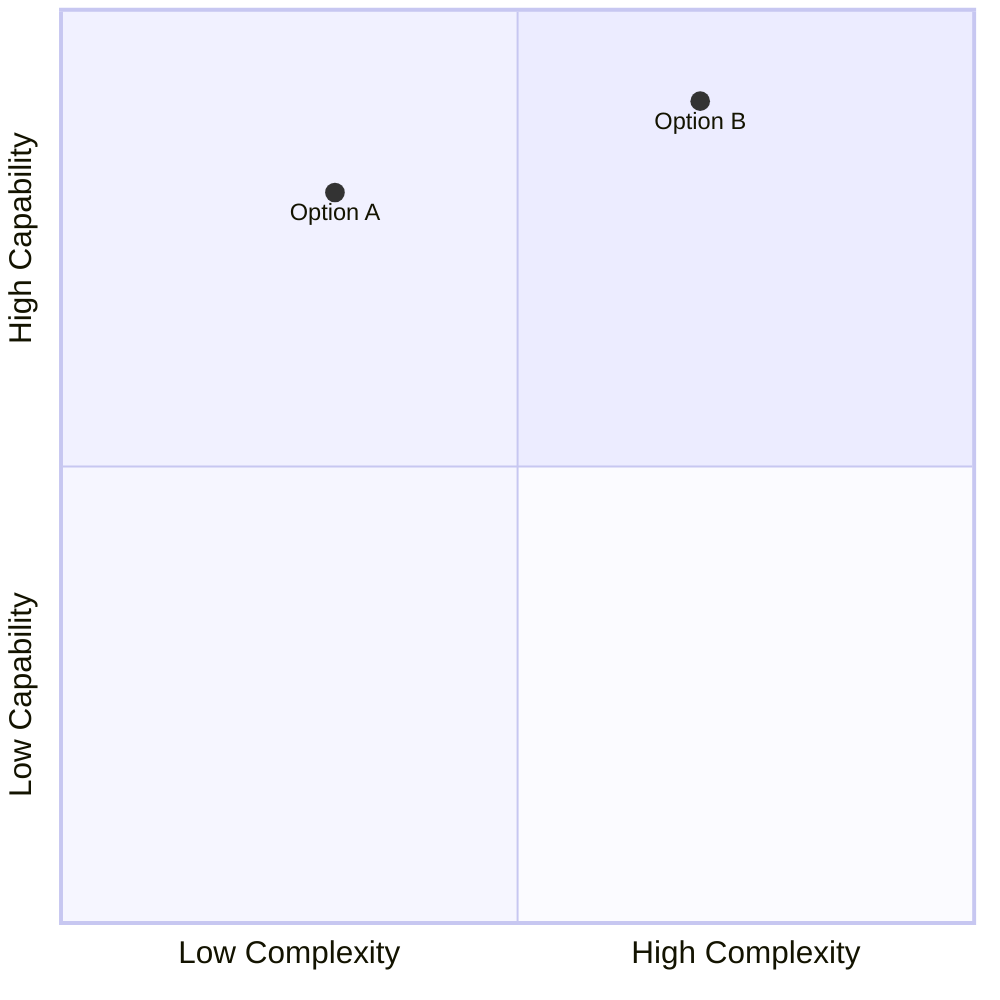

# Diagrams Reference

How to decide whether a diagram belongs in research output, and how to author it in both representations (markdown + HTML). Read this when you're considering a diagram.

## The Rubric — default is NO diagram

Every diagram must pass this gate. When in doubt, prose or a table wins.

**A diagram EARNS its place** when it shows structure that prose serializes poorly:
- Data flow and process isolation (what runs where, what crosses a boundary)
- Interaction sequences between 2+ systems over time (handshakes, webhook flows, retry paths)
- Topology (network layout, deployment shape)
- A relationship drawn against the **user's actual system** — real component names from their repo. These are consistently the most valuable diagrams a report can carry.

**A diagram is DECORATION** when it re-linearizes the report's own argument — the reader already has that structure as headings and prose:
- **Table-of-contents mindmaps are banned.** A mindmap whose branches are the report's own sections adds nothing.
- The index gets **no concept map by default** — only a diagram that passes the EARNS test.
- A "decision funnel" that repeats the takeaways list is decoration too.

**A diagram is HARMFUL** when it fabricates precision:
- **Speculative Gantt charts are banned.** Day-counts for unstarted work invent data. A Gantt is acceptable only for schedules that actually exist (recorded plans with real dates).
- Quadrant positions, percentages, or axis values that no source supports get the same treatment as unverified numbers: don't draw what you can't cite or tag as estimated.

Simple lists, single-dimension comparisons, and 2–3 step linear flows are tables/prose, not diagrams.

## Dual Representation

Markdown is canonical; HTML is the view. Every diagram exists in both:

| In the `.md` | In the `.html` |
|---|---|
| ```mermaid fence | Rendered Mermaid diagram (themed to the active palette) |
| ```mermaid fence | Hand-authored inline SVG (when you author one — see below) |
| Prose description | Hand-authored inline SVG that Mermaid can't express |

Rules:
- The `.md` must always carry a machine-readable representation: a Mermaid fence when the diagram is expressible in Mermaid, otherwise a concise prose description of what the visual shows. AI consumers (dr-prd, dr-plan) and grep read the markdown — never leave a diagram that exists only as SVG in the HTML.
- Hand-authored SVG lives in the `.md` as raw HTML (a `<figure>` block) — it passes through the renderer untouched. Place the equivalent Mermaid fence or prose description directly adjacent (an HTML comment above the figure works: `<!-- diagram: [description] -->`), so the markdown remains self-explanatory.

## Choosing Mermaid vs Hand-Authored SVG

**Mermaid** when the diagram fits a standard notation: flowcharts, sequence diagrams, ER diagrams, block diagrams. Fast to author, readable in the raw markdown, themed automatically.

**Hand-authored SVG** when:
- Layout carries meaning Mermaid's auto-layout would destroy (spatial arrangements, aligned timelines, annotated axes)
- Mermaid's output for this content is cluttered or misleadingly arranged
- You need annotation styles Mermaid doesn't support (callout arrows to specific points, region shading)

If Mermaid renders it cleanly, prefer Mermaid — it keeps the markdown fully self-describing.

## Mermaid Guidance

All standard diagram types render in the HTML view (verified over `file://`): flowchart, sequence, class, state, ER, journey, gantt, pie, mindmap, quadrant, block.

**Theming constraint — no hardcoded colors.** The HTML view re-renders Mermaid with theme variables when the reader switches palette or light/dark mode. Inline `style`, `classDef` fills, and `%%{init}%%` color overrides bake in colors that break palette switching. Express emphasis structurally (labels, edge styles, grouping), not with color.

### Flowchart — decision processes and data flow



`LR` for linear pipelines, `TD` for decision trees and hierarchies.

### Sequence — system interactions over time



Solid arrows (`->>`) for requests, dashed (`-->>`) for responses. `Note over` for context. This is the type that most often earns its place — packet fates, auth handshakes, retry flows.

### ER — data models



### Block — architecture / component layout



### Quadrant — two-axis comparison

Only with defensible positions — axis placements are numbers and follow the measured-vs-estimated rule:



### Mindmap / Gantt — almost never

Mindmaps of the report's own structure are banned (see rubric); a mindmap is defensible only for mapping an external domain where the tree shape itself is the finding. Gantt only for schedules that actually exist.

## Hand-Authored SVG Conventions

Author inside a `<figure>` using the template's `.dg` classes so the diagram themes automatically with palette/mode switches — never hardcode fill/stroke colors:

```html
<!-- diagram: request path from client through proxy to origin, showing where TLS terminates -->
<figure>
  <div class="frame">
    <svg class="dg" viewBox="0 0 720 240" role="img" aria-label="[what it shows]">
      <rect class="box" x="20" y="90" width="140" height="60" rx="8"/>
      <text class="lbl" x="90" y="125" text-anchor="middle">Client</text>
      <rect class="box-accent" x="300" y="90" width="140" height="60" rx="8"/>
      <text class="lbl" x="370" y="125" text-anchor="middle">Proxy</text>
      <line class="edge" x1="160" y1="120" x2="296" y2="120"/>
      <text class="lbl-sm" x="228" y="110" text-anchor="middle">TLS</text>
    </svg>
  </div>
  <figcaption>Where TLS terminates on the request path</figcaption>
</figure>
```

**Class vocabulary** (styled by the report's stylesheet):

| Class | Use |
|---|---|
| `.dg` on the `<svg>` | Enables theming; mono font, responsive width |
| `.box` / `.box-accent` / `.box-danger` | Node rectangles: neutral / highlighted / warning |
| `.lbl` / `.lbl-sm` | Primary / secondary text |
| `.edge` / `.edge-dash` | Solid / dashed connectors |
| `.arrowhead` | Marker fills |
| `.pt` / `.axis` | Data points / chart axes |

**Layout behavior:**
- Always set a `viewBox`; the SVG scales to the column width.
- `<figure class="wide">` breaks out beyond the text column (up to ~1180px, capped to the viewport) for diagrams that need horizontal room.
- `<figure class="scroll">` adds horizontal scrolling as a fallback for intrinsically wide content.
- Any figure containing an SVG (including rendered Mermaid) is click-to-zoom automatically — readers can enlarge; you don't need to shrink content to fit.
- Add `<figcaption>` when the takeaway isn't obvious from the drawing.

## Formatting Tips

- Keep diagrams focused — if it's getting complex, split into multiple smaller diagrams
- Label arrows/connections when the relationship isn't obvious
- Use consistent component names across diagrams in the same research — and match the user's real system names where applicable
- Test that Mermaid syntax is valid — a broken diagram is worse than none
- One diagram per concept; don't restate the same structure as both Mermaid and a table
